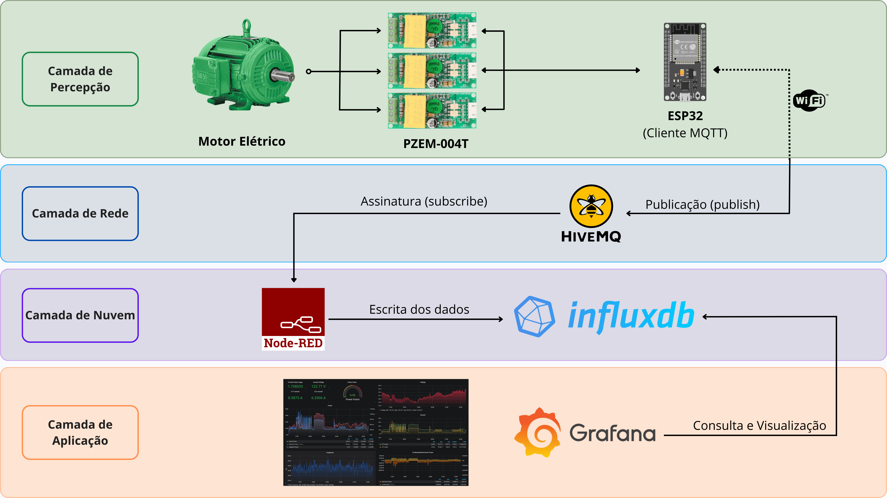
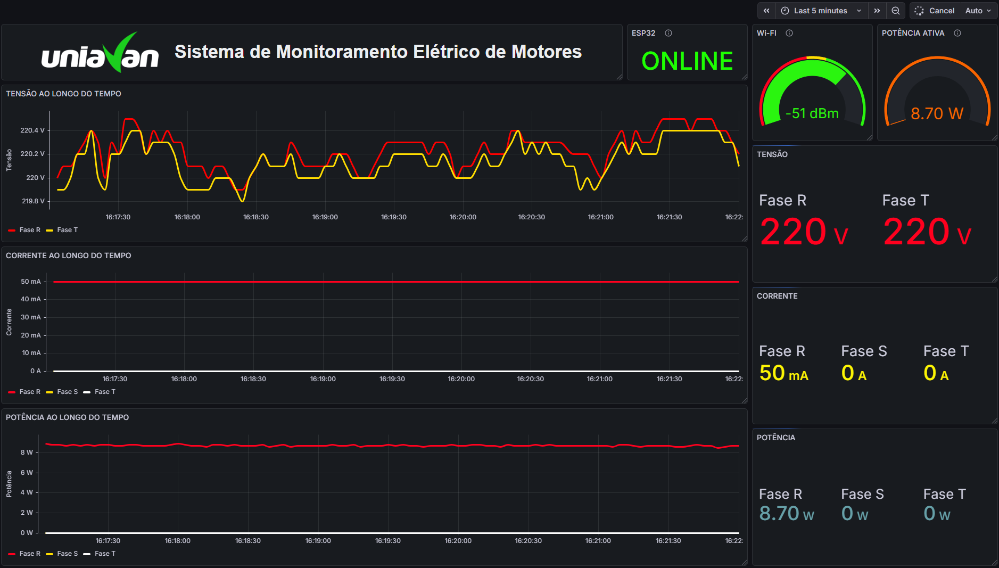

# Sistema IoT para Monitoramento Elétrico de Motores

Sistema desenvolvido como Trabalho de Conclusão de Curso do curso de Sistemas de Informação da UNIAVAN, com o objetivo de implementar uma arquitetura IoT capaz de coletar, transmitir, armazenar e visualizar parâmetros elétricos de motores de indução, fornecendo suporte a estratégias de manutenção preditiva.

---

## Arquitetura do Sistema

<p align="center">
  
</p>

A arquitetura foi estruturada em quatro camadas:

### Camada de Percepção

Responsável pela aquisição dos dados elétricos utilizando três módulos PZEM-004T conectados ao ESP32.

### Camada de Rede

Responsável pela transmissão das informações utilizando Wi-Fi e o protocolo MQTT.

### Camada de Nuvem

Responsável pelo processamento dos dados através do Node-RED e armazenamento temporal utilizando InfluxDB.

### Camada de Aplicação

Responsável pela consulta e visualização dos dados através de dashboards desenvolvidos no Grafana.

---

## Dashboard de Monitoramento

<p align="center">
  
</p>

O dashboard apresenta informações sobre:

* Estado operacional do ESP32;
* Intensidade do sinal Wi-Fi (RSSI);
* Potência ativa total;
* Tensão por fase;
* Corrente por fase;
* Potência ativa por fase;
* Histórico temporal das medições.

---

## Estrutura do Payload MQTT

O firmware envia as medições em formato CSV.

```text
tensao_r,corrente_r,potencia_r,tensao_s,corrente_s,potencia_s,tensao_t,corrente_t,potencia_t,valido_r,valido_s,valido_t,rssi
```

Exemplo:

```text
217.50,0.05,8.30,217.40,0.00,0.00,217.60,0.00,0.00,1,1,1,-51
```

---

## Processamento dos Dados

O Node-RED é responsável por:

1. Receber mensagens MQTT;
2. Validar a estrutura do payload;
3. Converter valores para formato numérico;
4. Tratar leituras inválidas;
5. Calcular a potência total;
6. Estruturar Fields e Tags;
7. Persistir os dados no InfluxDB.

---

## Estrutura de Armazenamento no InfluxDB

### Measurement

```text
grandezas_eletricas
```

### Tags

```text
dispositivo
tipo_carga
```

### Fields

```text
tensao_r
corrente_r
potencia_r

tensao_s
corrente_s
potencia_s

tensao_t
corrente_t
potencia_t

potencia_total

valido_r
valido_s
valido_t

rssi
```

---

## Metodologia Experimental

Foram realizados experimentos para avaliação da arquitetura proposta considerando:

### Latência MQTT

Tempo decorrido entre a publicação da mensagem pelo ESP32 e seu recebimento pelo Node-RED.

### Taxa de Entrega

Percentual de mensagens recebidas em relação ao total de mensagens transmitidas.

### Latência Ponta a Ponta

Tempo observado entre a ocorrência de um evento físico e sua visualização no dashboard Grafana.

Os resultados experimentais, metodologia detalhada e análise estatística encontram-se descritos no Trabalho de Conclusão de Curso associado a este projeto.

---

## Ferramentas e Tecnologias Utilizadas

* Docker
* Arduino IDE
* ESP32
* MQTT
* HiveMQ Cloud
* Node-RED
* InfluxDB
* Grafana

---

## Reprodução do Projeto

As instruções necessárias para reprodução da solução proposta neste trabalho estão disponíveis no documento abaixo:

💻⚙ **[Guia de Implantação](docs/guia_de_implantacao.md)**

O guia contempla a montagem física, configuração do firmware do ESP32, criação da infraestrutura MQTT, implantação dos serviços Node-RED, InfluxDB e Grafana, bem como a integração entre todos os componentes da arquitetura.

---

## Autor

**João Airton Gomes de Sousa**

Curso de Sistemas de Informação | UNIAVAN

---

## Licença

Este projeto foi desenvolvido para fins acadêmicos como parte do Trabalho de Conclusão de Curso do curso de Sistemas de Informação da UNIAVAN.
