# Guia de Implantação do Projeto

Este documento apresenta o procedimento completo para reprodução e implantação do sistema IoT para monitoramento elétrico de motores. O guia contempla desde a montagem física do protótipo até a configuração dos serviços responsáveis pela transmissão, processamento, armazenamento e visualização dos dados.

---

## 1. Pré-Requisitos

Antes de iniciar, é necessário possuir:

* ESP32;
* Módulos PZEM-004T v4.0;
* Cabos para conexão;
* Fonte de alimentação 5V;
* Computador com Docker Desktop instalado;
* Arduino IDE instalada;
* Conta no HiveMQ Cloud;
* Acesso à internet;
* Repositório do projeto clonado localmente.

---

## 2. Montagem Física do Protótipo

A primeira etapa consiste na montagem física do protótipo responsável pela aquisição dos dados elétricos.

O protótipo utiliza o ESP32 como unidade principal de processamento e comunicação, enquanto os módulos PZEM-004T realizam a medição das grandezas elétricas.

<p align="center">
  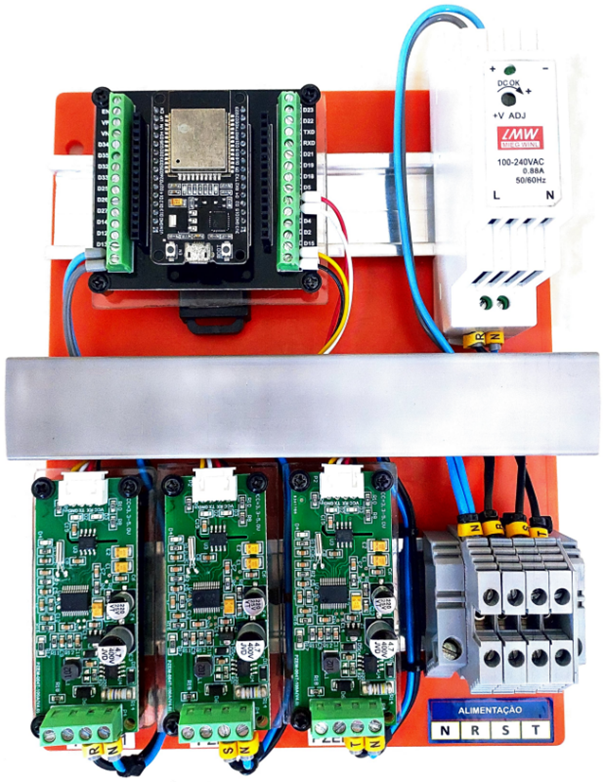
</p>

---

## 3. Conexões Elétricas

Os módulos PZEM-004T devem ser conectados ao ESP32 utilizando comunicação serial UART.

Cada módulo é responsável pela medição de uma fase do sistema monitorado.

<p align="center">
  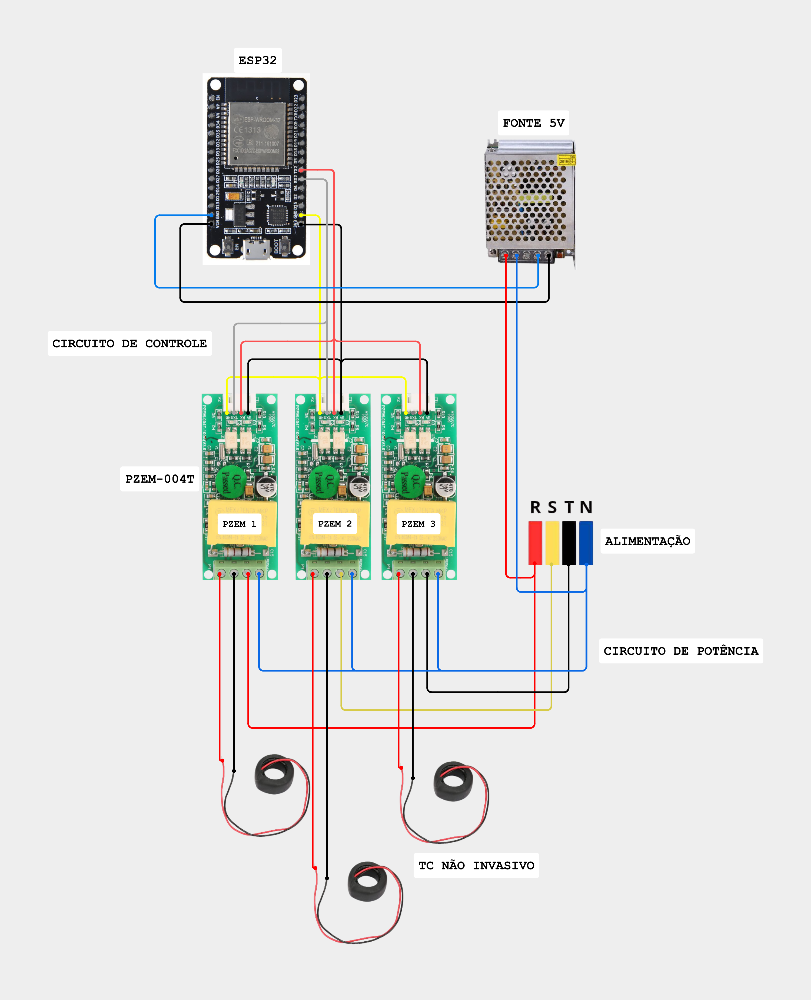
</p>

Antes de energizar o circuito, é necessário conferir:

* polaridade da alimentação;
* conexão dos pinos RX e TX;
* isolamento das conexões elétricas;
* alimentação adequada do ESP32.

> **Atenção:** medições em corrente alternada envolvem risco elétrico. A montagem deve ser realizada com o circuito desenergizado e com os devidos cuidados de segurança.

---

## 4. Preparação do Ambiente de Desenvolvimento

O firmware foi desenvolvido utilizando a Arduino IDE, ambiente responsável pela edição, compilação e gravação do código no ESP32.

### 4.1 Instalação da Arduino IDE

1. Faça o download da Arduino IDE no site oficial.
2. Execute o instalador e conclua a instalação utilizando as opções padrão.
3. Após a instalação, abra a Arduino IDE.

### 4.2 Instalação do Suporte ao ESP32

Por padrão, a Arduino IDE não possui suporte às placas ESP32. Portanto, é necessário adicionar o repositório de placas da Espressif.

1. Acesse **Arquivo → Preferências**.
2. No campo **URLs do Gerenciador de Placas Adicionais**, adicione o endereço abaixo:

```text
https://dl.espressif.com/dl/package_esp32_index.json
```

3. Clique em **OK** para salvar as alterações.

<p align="center">
  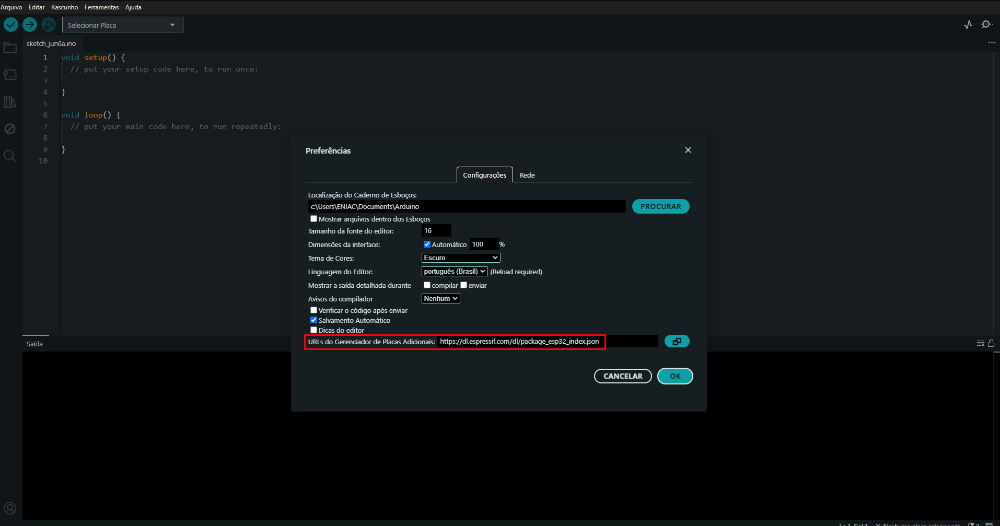
</p>

4. Acesse **Ferramentas → Placa → Gerenciador de Placas**.
5. Pesquise por **ESP32**.
6. Localize o pacote **esp32 by Espressif Systems**.
7. Clique em **Instalar**.
8. Aguarde a conclusão da instalação.

<p align="center">
  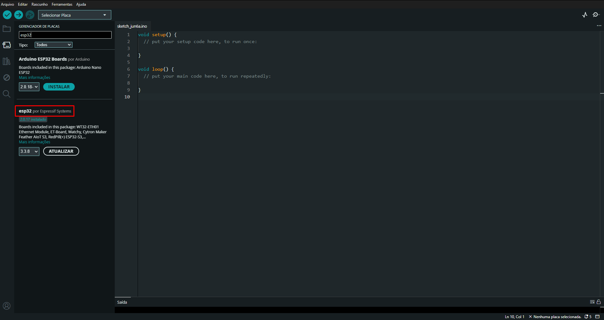
</p>

Após esse procedimento, a Arduino IDE estará preparada para compilar programas para o ESP32.

### 4.3 Instalação das Bibliotecas Necessárias

O firmware utiliza as bibliotecas listadas abaixo.

```text
WiFi.h, WiFiClientSecure.h, PubSubClient.h e PZEM004Tv30.h
```

`WiFi.h` e `WiFiClientSecure.h` são instaladas automaticamente juntamente com o pacote do ESP32.

Para instalar as demais bibliotecas:

1. Acesse **Ferramentas → Gerenciar Bibliotecas**.
2. Pesquise por **PubSubClient**.
3. Instale a biblioteca desenvolvida por **Nick O'Leary**.
4. Pesquise por **PZEM004Tv30**.
5. Instale a biblioteca desenvolvida por **mandulaj**.


Após a instalação de todas as dependências, o ambiente estará pronto para compilação e gravação do firmware.

---

## 5. Configuração do Broker MQTT HiveMQ Cloud

O broker MQTT utilizado no projeto é o HiveMQ Cloud.

### 5.1 Criação da Instância

1. acessar o HiveMQ Cloud;
2. criar uma conta;
3. criar uma instância gratuita;

Após a criação da instância HiveMQ Cloud, é necessário criar as credenciais que serão utilizadas pelo ESP32 para autenticação no broker.

1. Acesse a instância criada no HiveMQ Cloud.
2. Abra a aba **Access Management**.
3. Na seção **Authentication**, clique em **Add Credentials**.

<p align="center">
  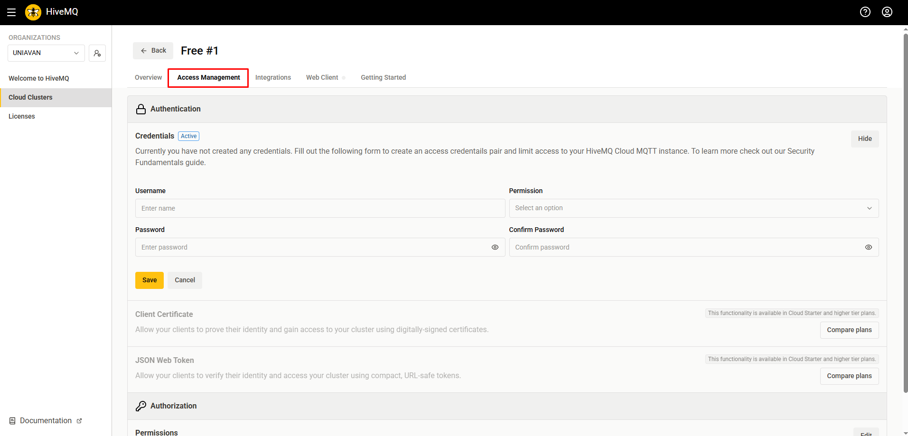
</p>

4. Informe um nome de usuário para autenticação.
5. Defina uma senha segura.
6. Selecione o tipo de permissão
7. Clique em **Save** para concluir o cadastro.

As credenciais criadas serão utilizadas posteriormente no arquivo `secrets.h` do firmware.

---

## 6. Firmware

Abrir o firmware localizado em:

```text
firmware/monitoramento/telemetria_motor_v1.0.ino
```

Editar o arquivo de credenciais:

```text
firmware/monitoramento/secrets.h
```

Exemplo de estrutura:

```cpp
const char* WIFI_SSID = "rede_wi-fi";
const char* WIFI_PASSWORD = "senha";

#define MQTT_HOST     "************************.s1.eu.hivemq.cloud"
#define MQTT_PORT     8883
#define MQTT_USER     "usuario"
#define MQTT_PASS     "senha"
```

---

## 7. Gravação do Firmware no ESP32

Com o ESP32 conectado ao computador:

1. abrir o arquivo `.ino` na Arduino IDE;
2. selecionar a placa ESP32 correta;
3. selecionar a porta serial correspondente;
4. compilar o firmware;
5. gravar o código no ESP32;
6. abrir o monitor serial para verificar os logs de conexão.

A comunicação estará funcionando corretamente quando o monitor serial indicar conexão Wi-Fi ativa e conexão MQTT estabelecida.

---

## 8. Preparação da Infraestrutura Local com Docker

Os serviços Node-RED, InfluxDB e Grafana foram executados localmente por meio de contêineres Docker.

Essa abordagem facilita a implantação, organização e reprodução do ambiente.

---

## 9. Criação da Rede Docker

Criar uma rede Docker para permitir que os contêineres se comuniquem entre si:

```bash
docker network create rede_docker
```

Isso permite que os serviços acessem uns aos outros pelo nome do contêiner.

---

## 10. Implantação dos Serviços em Docker

Os serviços utilizados no projeto foram executados em contêineres Docker utilizando imagens oficiais disponíveis no Docker Hub. O procedimento de instalação é semelhante para todos os componentes da arquitetura. A Figura X apresenta o processo de download da imagem do Node-RED por meio da interface gráfica do Docker Desktop.

<p align="center">
  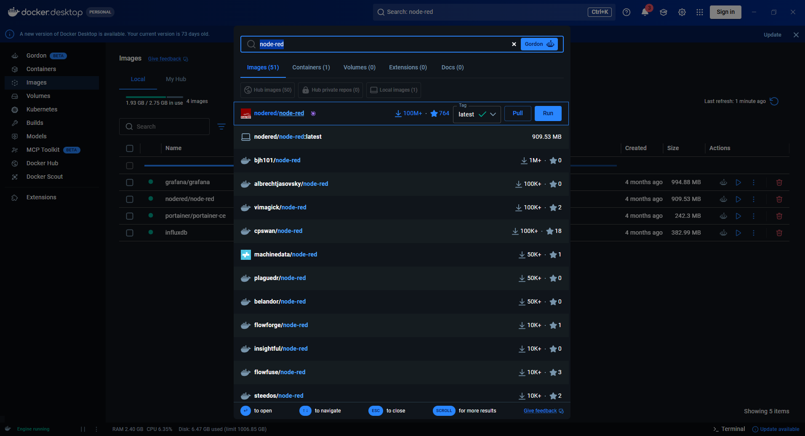
</p>

### 10.1 Exemplo de Download de Imagem

1. Abrir o Docker Desktop.
2. Acessar o menu **Images**.
3. Pesquisar pela imagem desejada.
4. Selecionar a imagem oficial do projeto.
5. Clicar em **Pull** para realizar o download.

Após a conclusão do download, a imagem ficará disponível localmente para criação do contêiner.

O mesmo procedimento foi utilizado para obtenção das imagens do InfluxDB e Grafana.

Após o download das imagens, os contêineres podem ser criados diretamente pela interface do Docker Desktop utilizando a opção **Run**, configurando apenas as portas de acesso de cada serviço.

---

### 11. Acesso ao InfluxDB

Acessar no navegador:

```text
http://localhost:8086
```

Realizar a configuração inicial informando:

* usuário administrador;
* senha;
* organização;
* bucket.

O bucket utilizado no projeto é:

```text
monitoramento_motores
```

<p align="center">
  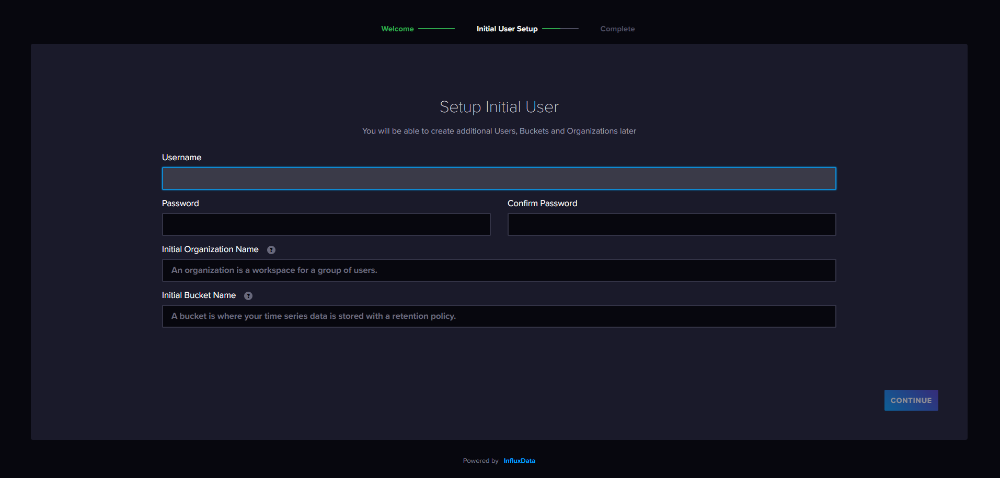
</p>

---

## 12. Geração do Token no InfluxDB

Após a configuração inicial, criar um token de acesso.

1. No menu lateral, selecionar a opção **API Tokens**.

Esse token será utilizado pelo Node-RED para gravar dados no banco e pelo Grafana para autenticação, portanto deve ser armazenado.

<p align="center">
  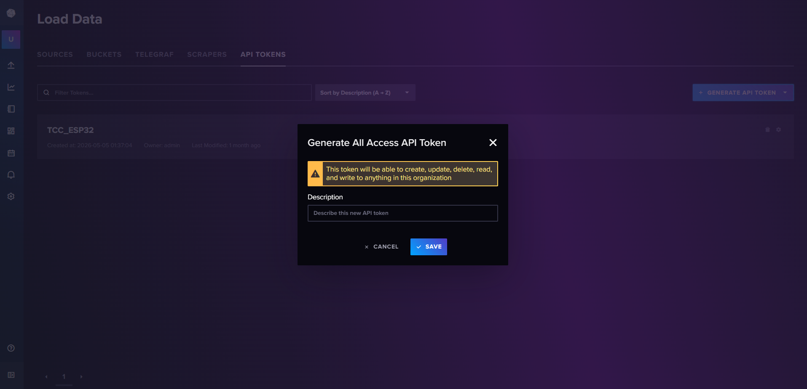
</p>

---

## 13. Instalação do Nó do InfluxDB no Node-RED

No Node-RED:

1. acessar o menu lateral;
2. selecionar `Manage palette`;
3. acessar a aba `Install`;
4. pesquisar por:

```text
node-red-contrib-influxdb
```

5. instalar o pacote.

<p align="center">
  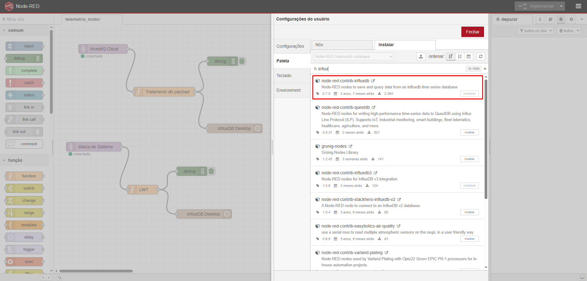
</p>

---

## 14. Importação do Fluxo Node-RED

Importar o fluxo localizado em:

```text
node-red/flows.json
```

No Node-RED:

1. acessar o menu lateral;
2. selecionar `Import`;
3. selecionar o arquivo `flows.json`;
4. confirmar a importação;
5. clicar em `Deploy`.

<p align="center">
  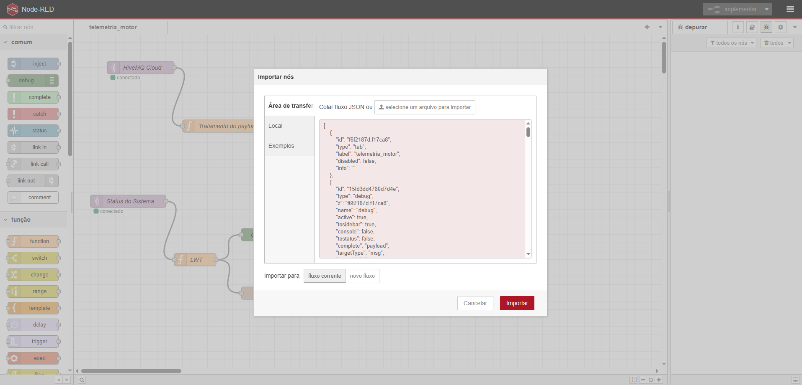
</p>

---

## 15. Configuração do Nó MQTT

Editar o nó MQTT do fluxo importado e preencher com as informações do broker HiveMQ Cloud criadas anteriormente:

```text
Host
Porta
Usuário
Senha
TLS habilitado
```

Após a configuração, o Node-RED deverá conseguir receber as mensagens publicadas pelo ESP32.

<p align="center">
  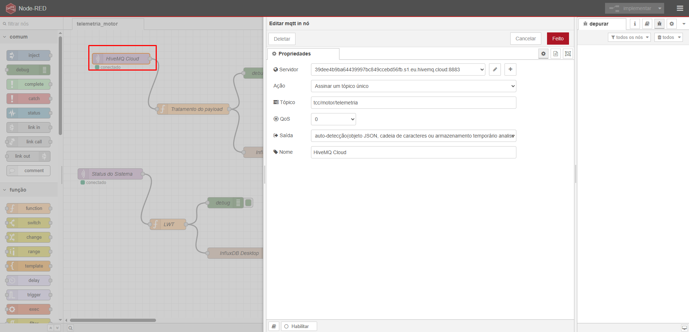
</p>

---

## 16. Configuração do Nó InfluxDB

Editar o nó InfluxDB no Node-RED e configurar:

```text
URL
Organização
Bucket
Token
```

Quando o Node-RED estiver no mesmo ambiente Docker que o InfluxDB, utilizar:

```text
http://influxdb:8086
```

<p align="center">
  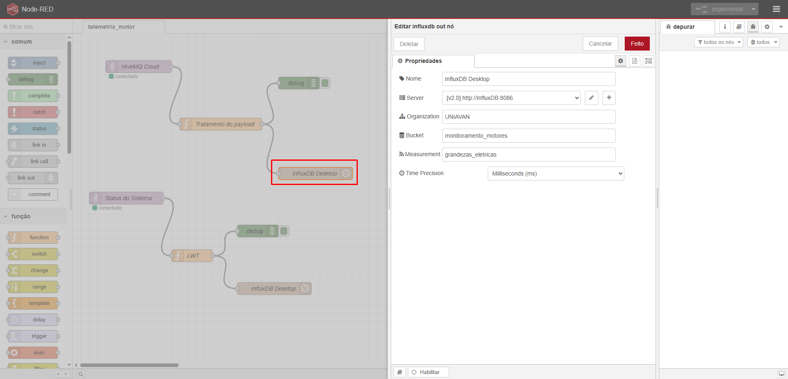
</p>

---

## 17. Tratamento dos Dados no Node-RED

O fluxo do Node-RED recebe o payload publicado pelo ESP32, realiza validações e converte os dados para o formato adequado ao InfluxDB.

Os script utilizado para tratamento está disponível em:

```text
node-red/tratamento_dos_dados.js
node-red/lwt.js
```

---

### 18. Acesso ao Grafana

Acessar no navegador:

```text
http://localhost:3000
```

Credenciais padrão:

```text
Usuário: admin
Senha: admin
```

Após o primeiro acesso, o Grafana solicitará a alteração da senha.

---

## 19. Configuração da Fonte de Dados no Grafana

No Grafana:

1. acessar `Connections`;
2. selecionar `Data sources`;
3. escolher `InfluxDB`;
4. configurar a conexão com o banco.

Informar:

```text
Linguagem Flux
URL
Organização
Bucket
Token
```

Quando o Grafana estiver na mesma rede Docker do InfluxDB, utilizar:

```text
http://influxdb:8086
```

<p align="center">
  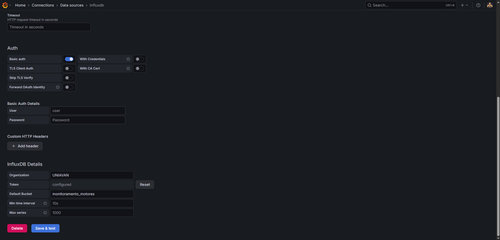
</p>

---

## 20. Importação do Dashboard

Importar o dashboard localizado em:

```text
grafana/dashboard.json
```

No Grafana:

1. acessar `Dashboards`;
2. selecionar `New`;
3. selecionar `Import`;
4. carregar o arquivo `dashboard.json`;
6. concluir a importação.

---

## Problemas Comuns

| Problema                       | Possível causa                        | Solução                              |
| ------------------------------ | ------------------------------------- | ------------------------------------ |
| ESP32 não conecta ao Wi-Fi     | SSID ou senha incorretos              | Conferir o arquivo `secrets.h`       |
| ESP32 não conecta ao MQTT      | Host, porta ou credenciais incorretas | Revisar dados do HiveMQ              |
| Node-RED não recebe mensagens  | Tópico MQTT incorreto / autenticação  | Revisar configurações do nó Mqtt     |
| Node-RED não grava no InfluxDB | Token ou bucket incorreto             | Revisar configuração do nó InfluxDB  |
| Grafana não exibe dados        | Fonte de dados incorreta              | Testar conexão com o InfluxDB        |
| Dados aparecem vazios          | Intervalo de tempo incorreto          | Ajustar o filtro do dashboard        |

---